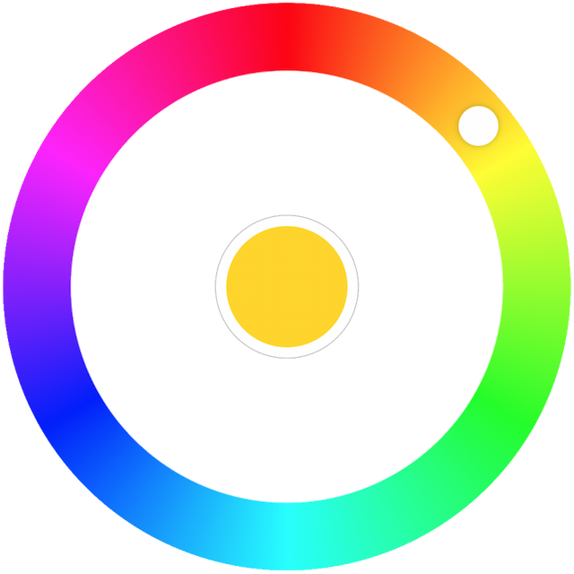

## Radial Color Picker - Vue

<p align="center"></p>

<p align="center"><a href="https://www.npmjs.com/package/@radial-color-picker/vue-color-picker">  </a> <a href="https://www.npmjs.com/package/@radial-color-picker/vue-color-picker">  </a> <a href="https://www.npmjs.com/package/@radial-color-picker/vue-color-picker">  </a></p>

## Introduction

Great UX starts with two basic principles - ease of use and simplicity. Selecting a color should be as easy as moving a slider, clicking a checkbox or pressing a key just like other basic form elements behave.

This is a flexible and minimalistic color picker. Developed with mobile devices and keyboard usage in mind. Key features:
* Small size - 3.8 KB gzipped (JS and CSS combined)
* Supports touch devices
* Optimized animations
* Ease of use
    * Double click anywhere to move the knob to a color
    * <kbd>Tab</kbd> to focus the picker
    * <kbd>Up</kbd> or <kbd>Right</kbd> arrow key to increase hue. Hold <kbd>Ctrl</kbd> to go quicker
    * <kbd>Bottom</kbd> or <kbd>Left</kbd> arrow key decrease hue. Hold <kbd>Ctrl</kbd> to go quicker
    * <kbd>Enter</kbd> to select a color and close the picker or to open it
    * Mouse <kbd>ScrollUp</kbd> to increase and <kbd>ScrollDown</kbd> to decrease hue (Opt-in)

## Quick Links

* [Demos](#user-content-demos)
* [Usage](#user-content-usage)
* [Options](#user-content-options)
* [FAQ](#user-content-questions)

## <a name="demos">Demos</a>

## <a name="usage">Usage</a>

#### With Module Build System
Color Picker on [npm](https://www.npmjs.com/package/@radial-color-picker/vue-color-picker)
```bash
npm install @radial-color-picker/vue-color-picker
```

And in your app:

```vue
<template>
    <color-picker v-model="color"></color-picker>
</template>

<script>
import ColorPicker from '@radial-color-picker/vue-color-picker';

export default {
    components: { ColorPicker },
    data() {
        return {
            color: {
                hue: 50,
                saturation: 100,
                luminosity: 50,
                alpha: 1
            },
        };
    },
};
</script>

<style>
@import '~@radial-color-picker/vue-color-picker/dist/vue-color-picker.css';
</style>
```

Depending on your build tool of choice (webpack, browserify, rollup) you may have to setup the appropriate loaders or plugins. Checkout the [examples](./examples) folder. There's an example with browserify and with webpack. If you're using `vue-cli` or `poi` you don't have to do anything else - these tools come preconfigured and support CSS/SCSS import out of the box.

#### UMD version

You can also use the minified sources directly:

```html
<head>
    <script src="https://unpkg.com/vue"></script>
    <script src="https://unpkg.com/@radial-color-picker/vue-color-picker/dist/vue-color-picker.umd.min.js"></script>
    <link href="https://unpkg.com/@radial-color-picker/vue-color-picker/dist/vue-color-picker.css" rel="stylesheet">
</head>
<body>
    <color-picker v-model="color"></color-picker>

    <script>
        var ColorPicker = window.VueColorPicker;

        var app = new Vue({
            el: '#app',
            components: {
                ColorPicker: ColorPicker
            },
            data: {
                color: {
                    hue: 50,
                    saturation: 100,
                    luminosity: 50,
                    alpha: 1
                }
            }
        });
    </script>
</body>
```

[Back To Top](#user-content-quick-links)

## <a name="options">Options</a>
`<color-picker>` component has several props and events, of which only `v-model` is required. [See the example](./examples/with-config) which uses all options.

### Props

| Options       | Type     | Default/Description |
|---------------|----------|---------------------|
| `v-model`    | Object | Object for initializing/changing the color of the picker. Defaults to red: <br> `{hue: 0, saturation: 100, luminosity: 50, alpha: 1}`. |
| `v-bind:mouse-scroll` | Boolean | Use wheel (scroll) event to rotate. Defaults to false. |
| `v-bind:step` | Number | Amount of degrees to rotate the picker with keyboard and/or wheel. <br> Defaults to 2 degrees. |

### Events

| Options       | Type     | Description |
|---------------|----------|-------------|
| `v-on:select` | Function | Callback which is triggered when a color is selected. |
| `v-on:input`  | Function | A function to invoke when color is changed (i.e. on rotation). |

Example:
```vue
<template>
    <color-picker v-model="color" @select="onColorSelect"></color-picker>
</template>

<script>
import ColorPicker from '@radial-color-picker/vue-color-picker';

export default {
    components: { ColorPicker },
    data() {
        return {
            color: {
                hue: 50,
                saturation: 100,
                luminosity: 50,
                alpha: 1
            }
        }
    },
    methods: {
        onColorSelect() {
            // do something with this.color
        }
    }
};
</script>
```

[Back To Top](#user-content-quick-links)

## <a name="questions">First Asked Questions</a>

<details>
    <summary>How to select other shades of the solid colors?</summary>
    <p>We suggest to add a custom slider for saturation and luminosity or use <code>&lt;input type="range"&gt;</code>.</p>
</details>

<details>
    <summary>Why does Google Chrome throw a <code>[Violation] Added non-passive event listener to a scroll-blocking 'touchmove' event.</code> warning in the console?</summary>
    <p><code>touchmove</code> is used with <code>preventDefault()</code> to block scrolling on mobile while rotating the color knob. Even the <a href="https://github.com/WICG/EventListenerOptions/blob/gh-pages/explainer.md#removing-the-need-to-cancel-events">Web Incubator Community Group</a> acknowledges that in some cases a passive event listener can't be used.</p>
</details>

<details>
    <summary>Why is the scroll-to-rotate functionality not turned on by default?</summary>
    <p>It's another non-passive event that could potentially introduce jank on scroll. To rotate the color knob, but stay on the same scrolling position the <code>wheel</code> event is blocked with <code>preventDefault()</code>. Thus, if you really want this feature for your users you'll have to explicitly add <code>:mouse-scroll="true"</code>.</p>
</details>
<br>

[Back To Top](#user-content-quick-links)
